# 소액주주들을 위한 행동주의 플랫폼 - 하나인(HANAIN)

[프로젝트 홈페이지](/)

# 1. 프로젝트 소개

### 1-1. 프로젝트 기획배경

• 코로나19 이후, 개인투자자가 급격하게 증가하고 있는 모습을 볼 수 있음. 하지만 그에 비해 개인투자자들을 위한 플랫폼은 미비한 실정 <br/>
• 한국경영학회 논문에 따르면 개인과 기관 사이에는 정보의 양 뿐만 아니라 질적 비대칭성도 존재. <br/>
• 스튜어드십 코드 도입 이후 기관투자자의 의결권 행사가 증가. 그 이후 개인 투자자들의 행동주의 선례도 생기고 있음. <br/>

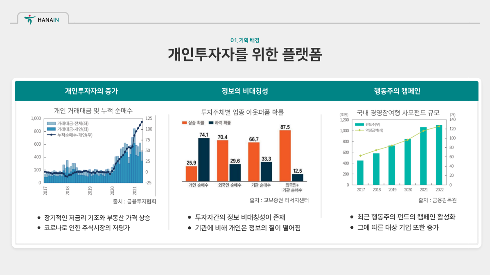 <br/>

### 1-2. 개인적인 경험

• 갖고있던 '우리벤처파트너스' 주식이 상장 1년 반만에 자진 상폐를 하게 됨.이 과정에서 지주사로 편입되었고, 부당한 교환가격이 산정되면서 소액주주연대가 활동 함 <br/>
• 16년도 경 주주행동 및 권리 행사를 위한 법인을 설립. 그 과정에서 증권사 지점의 협력 및 자문 경험이 있음. <br/>

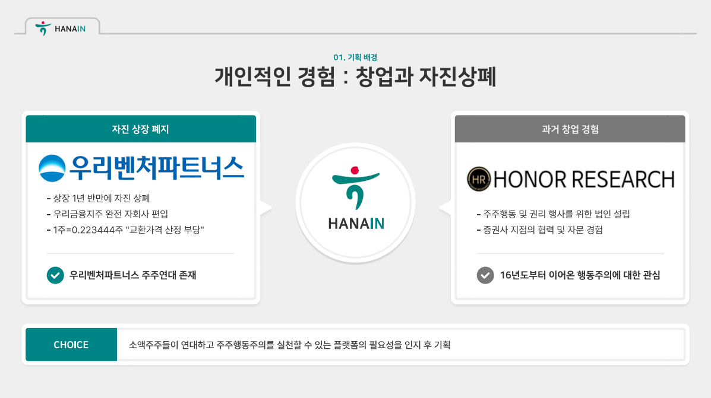 <br/>

### 1-3. 개발환경

```
- OS : window 10
- Framework : Spring Boot
- Server : tomcat9
- Tool : Eclipse, Sql Developer, Github
- DBMS : Oracle DBMS
```

### 1-4. 수행기간

개발기간: 2022.09.01 - 2022.10.20 <br/>

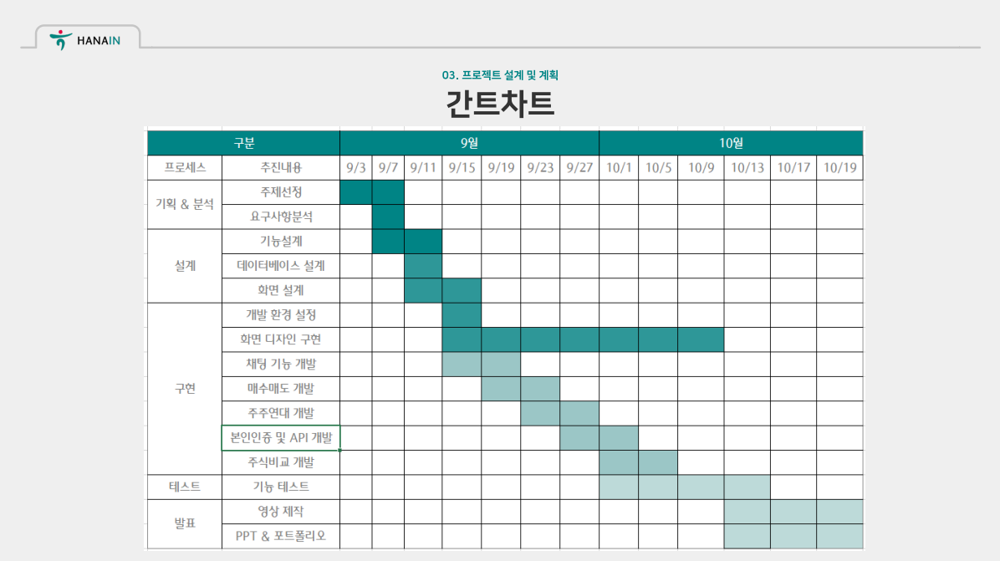 <br/>

# 2. 프로젝트 제안서

[프로젝트 제안서](/proposal.pdf)

### 2-1. 프로젝트 개요

• 인증된 주주들을 위한 모임 중계 및 정보 제공 플랫폼 <br/>
• 모든 사용자들이 본인 인증 및 주식 보유를 완료한 상태이므로 소액주주들이 연대하는 데 유리한 환경을 제공 <br/>

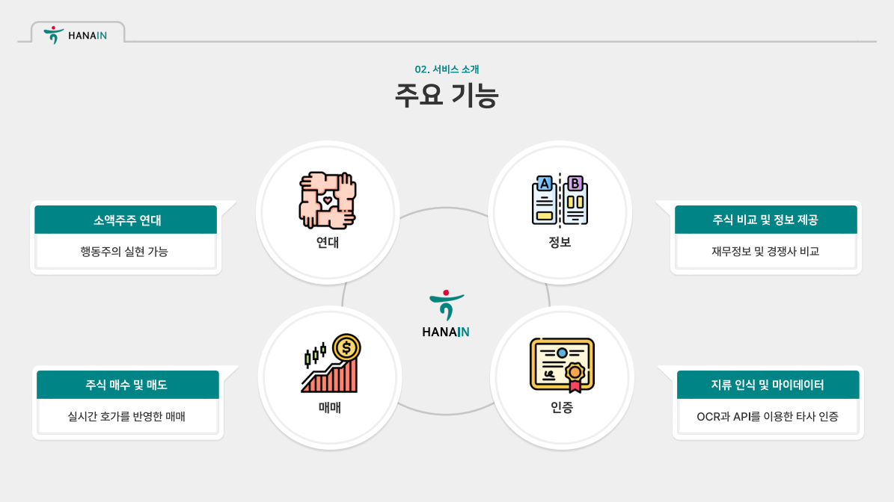 <br/>

• 연대 : 소액주주가 제시한 하나의 안건에 대하여 주주들이 동참할 수 있음 <br/>
• 정보 : 기본 공시 정보와 태그를 활용한 경쟁사 비교 가능 <br/>
• 매매 : 실제 주식 시장의 실시간 호가를 반영하여 주식 매수 매도 가능 <br/>
• 인증 : OCR과 가상의 마이데이터API를 활용한 타 증권사 계좌 정보 인증 <br/>

### 2-2. 타사 기능 비교

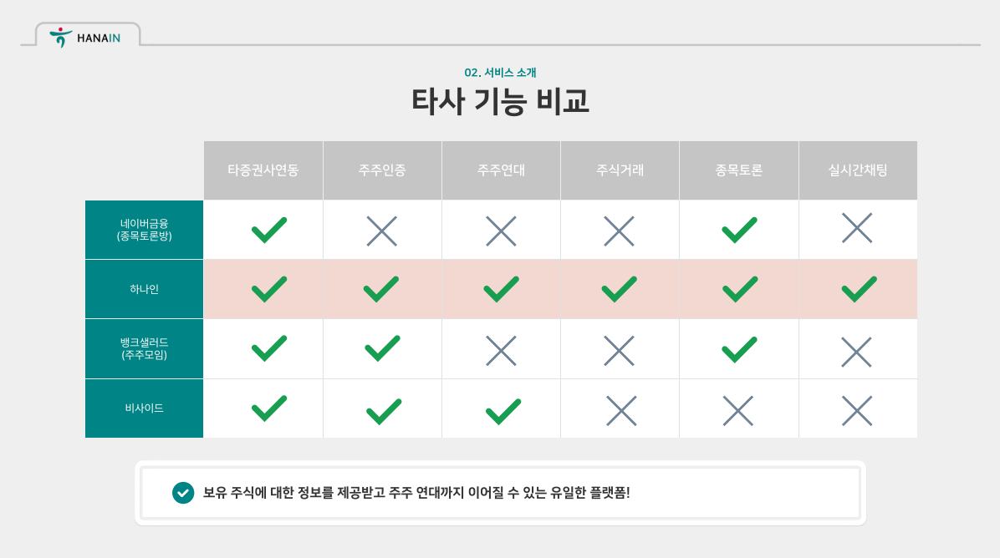 <br/>

• 현재 대부분 타사의 개인투자자들이 이용가능한 플랫폼은 단순한 의견 공유의 장 <br/>
• 올해 초 출시한 비사이드라는 플랫폼은 유일하게 주주행동주의를 추구하지만 개인이 직접 안건을 작성할 수 없고 회사가 선별한 캠페인에 한정하여 참여 가능 <br/>
• 또한 추가적인 회사 및 주식에 대한 정보는 얻을 수 없어 이미 어느정도 지식이 있는 주주만 접근이 가능 <br/>
• 하나인은 누구나 의견 개시를 할 수 있으며 주식에 대한 정보를 얻을 수 있는 유저 친화적인 플랫폼 <br/>

### 2-3. 시스템 아키텍처

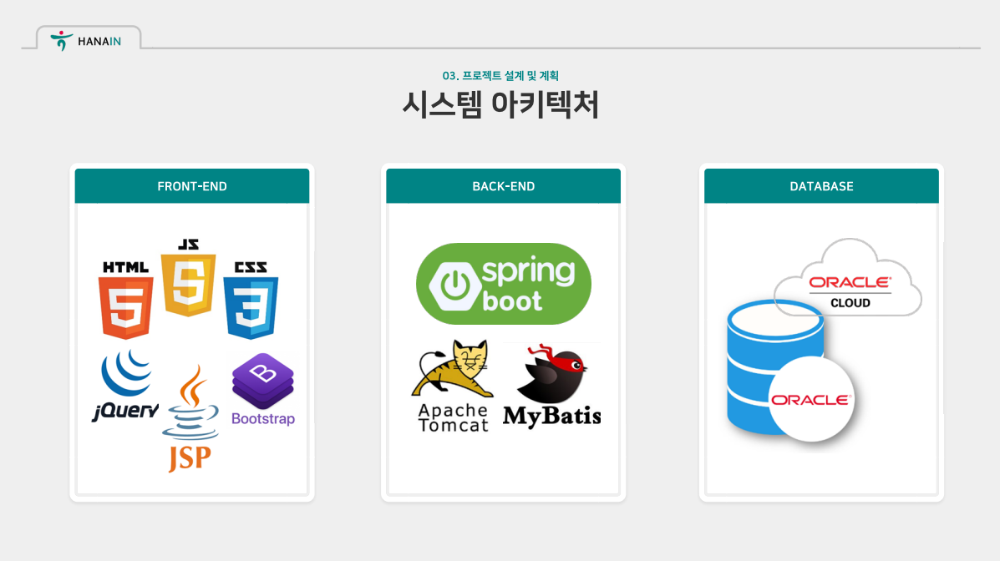 <br/>

### 2-4. 적용기술

• SPRING 기반 웹 애플리케이션 제작 <br/>
• SCHEDULER를 이용한 주주 제안 달성률 갱신 및 주가 정보 업데이트 <br/>
• COOL SMS를 이용한 본인 인증 <br/>
• NAVER CLOVA OCR을 활용한 지류 인식 <br/>
• WEB SOCKET을 활용한 개인 및 그룹 실시간 채팅 <br/>
• SELENIUM을 이용하여 주식 태그 동적 크롤링 <br/>

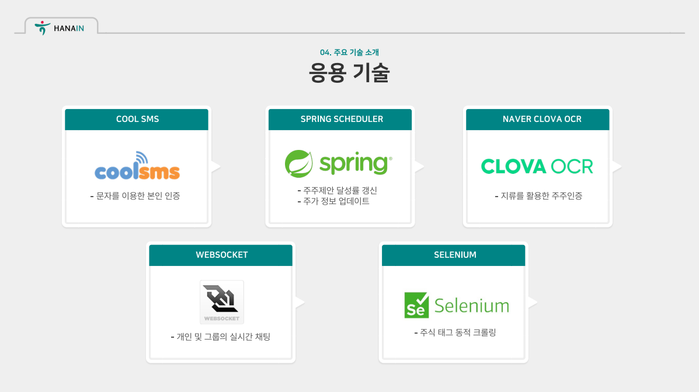 <br/>

# 3. 프로젝트 결과

### 3-1. 서비스 아키텍처

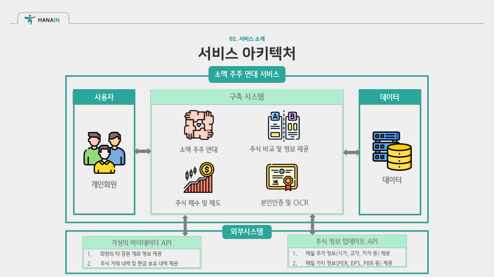 <br/>

• 외부에 구축된 가상의 마이데이터 API를 통해 타 증권사 계좌 정보 입력 <br/>
• 장 마감 이후, 당일의 주식 정보를 스케쥴러를 통해 자동으로 업데이트 <br/>

### 3-2. ERD

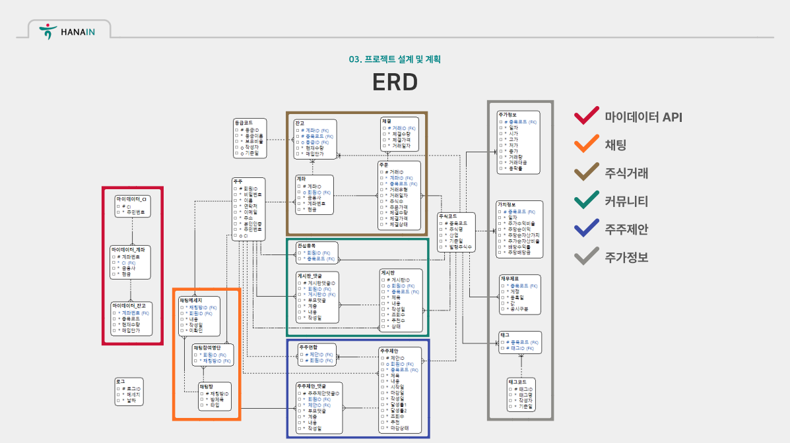 <br/>

## 발표 ppt

[발표자료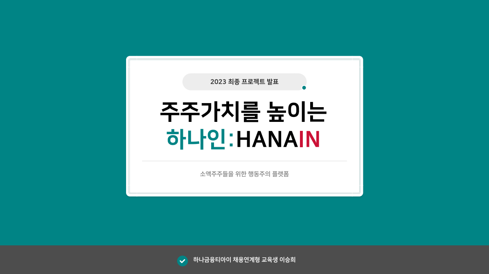](/project.pdf) <br/>

## 시연 동영상

<a href="https://youtu.be/HvvNSyFevJA">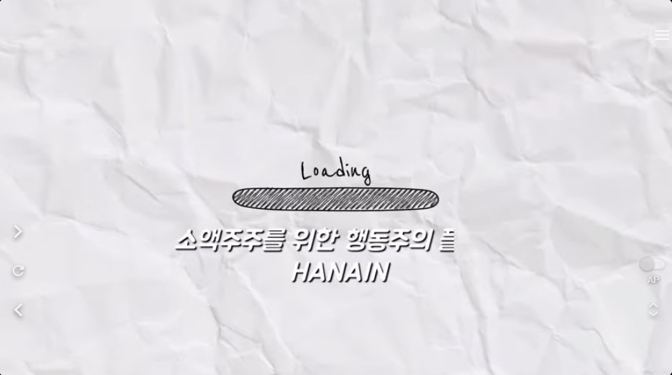</a><br/>

# 4. 본인 소개

| 구분           | 내용                                                                                          | 비고                                       |
| -------------- | --------------------------------------------------------------------------------------------- | ------------------------------------------ |
| 이름           | 이승희                                                                                        |         |
| 연락처         | lgs2234@naver.com                                                                             |                                            |
| Frontend skill | HTML, CSS, Javascript                                                                         |                                            |
| Backend skill  | Java, Spring, Oracle                                                                          |                                            |
| 자격증         | 회계관리 2급                                                                                  | 2017.06.20                                 |
|                | OPIC(IM2)                                                                                     | 2023.04.02                                 |
|                | SQL개발자 (SQLD자격)                                                                          | 2023.04.14                                 |
|                | 정보처리기사(필기)                                                                            | 2023.06.14                                 |
| 수상내역       | SUM 2기: Pre-Internship (최우수상)                                                            | 유진투자증권 리테일본부 (2017.05.14)       |
|                | 광명융합교육기술원 프로젝트 작품경진대회(동상)                                                | 광명융합기술교육원 (2023.10.13)            |
|                | 한국폴리텍대학 벤처창업아이템 경진대회 본선진출(동상확보)                                     | 중소벤처기업부(한국폴리텍대학)(2023.11.01) |
| 교육활동       | 웹 서비스 개발자 취업캠프(JAVA) ( 멀티캠퍼스 )                                                | 2022.06.20 ~ 2022.11.04 (760시간)          |
|                | 하나금융티아이 채용전환형 교육 1200시간( 한국폴리텍대학교 광명융합기술교육원 - 데이터분석과 ) | 2023.03.02 ~ 2023.10.20 (1200시간)         |
